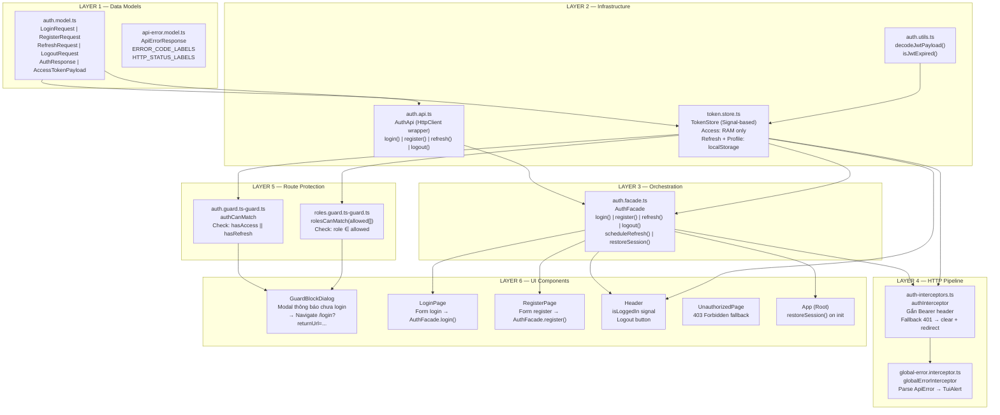
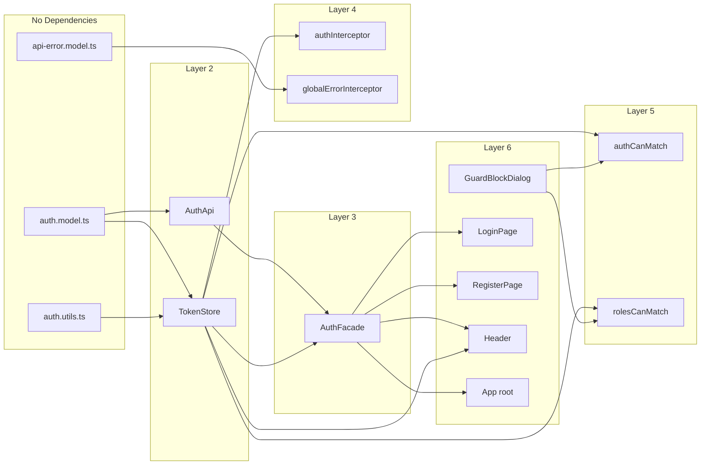

# LLM Reading Guide

## Mục tiêu tài liệu

Tài liệu này mô tả đầy đủ hệ thống `Security / Authentication / Authorization / Guard` của project `para-payment-channel`, bao gồm:

- data models;
- JWT utilities;
- token state management;
- auth orchestration;
- HTTP interceptor chain;
- route guards;
- UI dialog hỗ trợ guard;
- root bootstrap;
- end-to-end flows;
- security matrix;
- error matrix;
- design review.

## Cách đọc tối ưu cho LLM

Khi reasoning về hệ thống, nên đi theo thứ tự sau:

1. **Data contract**: `auth.model.ts`, `api-error.model.ts`
2. **Token semantics**: `auth.utils.ts`, `token.store.ts`
3. **Auth orchestration**: `auth.api.ts`, `auth.facade.ts`
4. **HTTP behavior**: `auth-interceptors.ts`, `global-error.interceptor.ts`
5. **Route protection**: `authCanMatch`, `rolesCanMatch`
6. **UX bridge**: `GuardBlockDialog`
7. **Bootstrap and lifecycle**: `App.restoreSession()`
8. **Cross-cutting flows**: login / refresh / guard / 401 / logout

## Core invariants

- `accessToken` chỉ tồn tại trong **RAM**.
- `refreshToken` được persist trong **localStorage**.
- `role`, `uid`, `username` được persist để hỗ trợ cold-start UI/guard.
- `TokenStore.role()` ưu tiên **JWT payload** trước, rồi mới fallback sang persisted value.
- `AuthFacade` là entry point chính cho UI.
- `authInterceptor` bỏ qua toàn bộ `/api/v1/auth/*`.
- `globalErrorInterceptor` đứng sau `authInterceptor` trong pipeline.
- `authCanMatch` xử lý **authentication**.
- `rolesCanMatch` xử lý **authorization**.
- Nếu chưa login, guard mở dialog thay vì redirect cứng.
- Logout phía client luôn cleanup local state kể cả khi server logout lỗi.
- `restoreSession()` được gọi **1 lần** khi app bootstrap.

## Fast mental model

### Session lifecycle ngắn gọn

```text
App start
  -> có refresh token?
     -> không: guest mode
     -> có: gọi refresh để lấy access token mới

Login/Register success
  -> lưu access token vào RAM
  -> lưu refresh token + profile vào localStorage
  -> schedule refresh trước khi access token hết hạn

API request non-auth
  -> authInterceptor gắn Bearer nếu có access token
  -> nếu backend trả 401: clear tokens + redirect /login

Logout
  -> cố gọi server logout
  -> luôn clear local state + cancel timer + redirect /login
```

### Phân tách trách nhiệm

| Concern | Nơi xử lý chính |
|---|---|
| Request/response types | `auth.model.ts` |
| API error mapping | `api-error.model.ts` |
| JWT decode / expiry | `auth.utils.ts` |
| Token/profile state | `token.store.ts` |
| API calls | `auth.api.ts` |
| Auth flow orchestration | `auth.facade.ts` |
| Bearer injection / 401 fallback | `auth-interceptors.ts` |
| Error alert UI | `global-error.interceptor.ts` |
| Authentication gate | `auth.guard.ts-guard.ts` |
| Authorization gate | `roles.guard.ts-guard.ts` |
| Login redirect UX | `guard-block-dialog.ts` |
| Session bootstrap | `app.ts` |

## Reasoning shortcuts

### Nếu câu hỏi là "vì sao user vẫn vào được route khi access token hết hạn?"
Trả lời nên bắt đầu từ:
- `authCanMatch` cho qua nếu còn `refreshToken`
- `restoreSession()` và `refresh()` có thể hydrate lại access
- nếu API vẫn 401 thì `authInterceptor` là fallback cuối

### Nếu câu hỏi là "vì sao role check không chặn ngay khi role null?"
Trả lời nên bắt đầu từ:
- `rolesCanMatch` có **null-role safety**
- mục tiêu là tránh false-positive 403 trong cold start / legacy session
- refresh/interceptor sẽ hydrate profile sau

### Nếu câu hỏi là "vì sao access token không lưu localStorage?"
Trả lời nên bắt đầu từ:
- giảm XSS exposure
- access token short-lived
- refresh token dùng để restore session

---

# Canonical Content (Preserved + LLM-indexable)

> Phần dưới đây giữ nguyên nội dung chuyên sâu gốc, chỉ được bao bọc bởi reading guide phía trên để tăng khả năng parse và reasoning.


# Phân Tích Chuyên Sâu: Security / Authentication / Authorization / Guard

> **Project**: `para-payment-channel` — Angular 19+ Standalone, Taiga UI  
> **Auth scheme**: JWT (Access Token + Refresh Token), Role-Based Access Control (RBAC)  
> **Backend API base**: `http://localhost:8080/api/v1/auth/`

---

## 1. Kiến Trúc Tổng Quan (Layer Diagram)



---

## 2. File Map — Tất Cả Thành Phần Security

| # | File | Layer | Vai trò |
|---|------|-------|---------|
| 1 | [auth.model.ts](file:///d:/__INTERN__LLQ__FE/para_payment_channel/para-payment-channel/src/app/core/models/auth.model.ts) | Data Model | Type definitions cho Request/Response/JWT Payload |
| 2 | [api-error.model.ts](file:///d:/__INTERN__LLQ__FE/para_payment_channel/para-payment-channel/src/app/core/models/api-error.model.ts) | Data Model | Error response structure + label mappings |
| 3 | [auth.api.ts](file:///d:/__INTERN__LLQ__FE/para_payment_channel/para-payment-channel/src/app/core/auth/auth.api.ts) | Infrastructure | Raw HTTP calls tới backend `/auth/*` |
| 4 | [auth.utils.ts](file:///d:/__INTERN__LLQ__FE/para_payment_channel/para-payment-channel/src/app/core/auth/auth.utils.ts) | Infrastructure | JWT decode + expiry check (pure functions) |
| 5 | [token.store.ts](file:///d:/__INTERN__LLQ__FE/para_payment_channel/para-payment-channel/src/app/core/auth/token.store.ts) | Infrastructure | Reactive token state management (Angular Signals) |
| 6 | [auth.facade.ts](file:///d:/__INTERN__LLQ__FE/para_payment_channel/para-payment-channel/src/app/core/facades/auth.facade.ts) | Orchestration | High-level auth operations + pre-emptive refresh timer |
| 7 | [auth-interceptors.ts](file:///d:/__INTERN__LLQ__FE/para_payment_channel/para-payment-channel/src/app/core/interceptors/auth-interceptors.ts) | HTTP Pipeline | Bearer injection + 401 fallback |
| 8 | [global-error.interceptor.ts](file:///d:/__INTERN__LLQ__FE/para_payment_channel/para-payment-channel/src/app/core/interceptors/global-error.interceptor.ts) | HTTP Pipeline | Global error display (runs AFTER auth interceptor) |
| 9 | [auth.guard.ts-guard.ts](file:///d:/__INTERN__LLQ__FE/para_payment_channel/para-payment-channel/src/app/core/guard/auth.guard.ts-guard.ts) | Route Protection | Authentication guard (CanMatch) |
| 10 | [roles.guard.ts-guard.ts](file:///d:/__INTERN__LLQ__FE/para_payment_channel/para-payment-channel/src/app/core/guard/roles.guard.ts-guard.ts) | Route Protection | Authorization guard (CanMatch + role check) |
| 11 | [guard-block-dialog.ts](file:///d:/__INTERN__LLQ__FE/para_payment_channel/para-payment-channel/src/app/components/dialogs/guard-block-dialog/guard-block-dialog.ts) | UI | Dialog hiện khi guard chặn user chưa login |
| 12 | [app.config.ts](file:///d:/__INTERN__LLQ__FE/para_payment_channel/para-payment-channel/src/app/app.config.ts) | Bootstrap | Đăng ký interceptor chain |
| 13 | [app.routes.ts](file:///d:/__INTERN__LLQ__FE/para_payment_channel/para-payment-channel/src/app/app.routes.ts) | Routing | Route definitions + guard assignments |
| 14 | [app.ts](file:///d:/__INTERN__LLQ__FE/para_payment_channel/para-payment-channel/src/app/components/root/app.ts) | Bootstrap | Root component, gọi `restoreSession()` |

---

## 3. Phân Tích Chi Tiết Từng Thành Phần

### 3.1. Data Models (`auth.model.ts`)

```
┌─────────────────────────────────────────────────────┐
│                   TYPE DEFINITIONS                   │
├─────────────────────────────────────────────────────┤
│ UserRole          = 'USER' | 'ADMIN' | string       │
│                                                     │
│ LoginRequest      = { username, password }           │
│ RegisterRequest   = { username, password }           │
│ RefreshRequest    = { refreshToken }                 │
│ LogoutRequest     = { refreshToken }                 │
│                                                     │
│ AuthResponse      = { accessToken?, refreshToken?,   │
│                       tokenType?, expiresInSeconds?, │
│                       message }                      │
│                                                     │
│ AuthTokensResponse extends AuthResponse              │
│   (all fields required, strict variant)              │
│                                                     │
│ AccessTokenPayload = { uid?, role?, status?,          │
│                        sub?, exp?, iat?, jti?, iss? } │
└─────────────────────────────────────────────────────┘
```

**Thiết kế đáng chú ý:**
- `AuthResponse` dùng optional fields vì endpoint `/logout` chỉ trả `{ message }` không có tokens
- `AuthTokensResponse` là strict variant — dùng khi biết chắc response sẽ có tokens (login/register/refresh)
- `AccessTokenPayload` có index signature `[key: string]: any` — cho phép backend thêm custom claims mà không break frontend
- `UserRole` là union với `string` fallback — extensible cho thêm roles mới

---

### 3.2. JWT Utilities (`auth.utils.ts`)

Hai pure functions, không có dependency injection:

#### `decodeJwtPayload(token: string): AccessTokenPayload | null`

```
Input: "eyJhbGci.eyJ1aWQiOjEsInJvbGUiOiJBRE1JTiIsInN1YiI6ImFkbWluIiwiZXhwIjoxNzE...}.signature"
                  ↓
Step 1: Split by '.' → parts[0]=header, parts[1]=payload, parts[2]=signature
Step 2: Validate parts.length === 3 (không thì return null)
Step 3: Base64url → Base64: replace('-' → '+'), replace('_' → '/')
Step 4: Pad base64 string (length % 4 === 0)
Step 5: atob(base64) → JSON string
Step 6: JSON.parse → AccessTokenPayload object
                  ↓
Output: { uid: 1, role: "ADMIN", sub: "admin", exp: 1711234567, iat: ... }
```

#### `isJwtExpired(token: string): boolean`

```
Input: JWT token string
  → decodeJwtPayload(token) → payload
  → payload.exp không có? → return true (expired)
  → Date.now() >= exp * 1000? → return true (expired)
  → return false (still valid)
```

> **Ghi chú**: JWT decode thực hiện client-side, KHÔNG verify signature. Đây là pattern chuẩn cho frontend — signature verification là trách nhiệm của backend.

---

### 3.3. Token Store (`token.store.ts`) — ★ Core State Management

**Architecture Pattern**: Signal-based reactive store, singleton (`providedIn: 'root'`)

#### Storage Strategy (Dual-layer)

```
┌──────────────────────────────────────────────────────────────┐
│                     TOKEN STORE                               │
├──────────────────────┬───────────────────────────────────────┤
│   RAM (Signal only)  │   localStorage (persisted)            │
├──────────────────────┼───────────────────────────────────────┤
│   _access            │   refreshToken    (key: 'refreshToken')│
│                      │   _role           (key: 'auth_role')   │
│                      │   _uid            (key: 'auth_uid')    │
│                      │   _username       (key: 'auth_username')│
└──────────────────────┴───────────────────────────────────────┘
```

**Tại sao Access Token chỉ giữ RAM?**
- Access token có lifetime ngắn (ví dụ 5 phút)
- Nếu tab bị refresh / đóng mở → access token mất → dùng refresh token để lấy mới
- Giảm attack surface: XSS không thể đọc access token từ localStorage

**Tại sao Role/UID/Username persist vào localStorage?**
- Khi access token hết hạn hoặc chưa được refresh, UI vẫn cần biết role để render đúng (ẩn/hiện nút, guard check)
- `role` computed dùng priority chain: `payload()?.role ?? this._role()` — ưu tiên JWT nếu có, fallback sang persisted

#### Computed Signals (Derived State)

```typescript
accessToken  = computed(() => this._access())           // Access token string | null
refreshToken = computed(() => this._refresh())           // Refresh token string | null
payload      = computed(() => access ? decode(access) : null)  // Decoded JWT | null

// Priority: JWT payload → localStorage persisted value
role     = computed(() => payload()?.role ?? this._role())
uid      = computed(() => payload()?.uid  ?? this._uid())
username = computed(() => payload()?.sub  ?? this._username())

isAccessExpired = computed(() => !access || isJwtExpired(access))
hasRefresh      = computed(() => !!this._refresh())
hasAccess       = computed(() => !!this._access())
```

#### Key Methods

| Method | Behavior |
|--------|----------|
| `setTokens(access, refresh)` | Lưu access vào RAM signal, refresh vào localStorage + signal. Decode access để persist role/uid/username |
| `clear()` | Xóa tất cả localStorage keys + reset tất cả signals về `null`. Returns `true` |
| `setProfileFromAccess(access)` | Private. Decode JWT → extract role/uid/username → sync vào cả localStorage + signals |

---

### 3.4. Auth API (`auth.api.ts`)

Thin HTTP wrapper, **không chứa business logic**:

```
AuthApi (@Injectable, providedIn: 'root')
│
├── base = 'http://localhost:8080/api/v1/auth'
│
├── register(body: RegisterRequest)  → POST /auth/register → Observable<AuthResponse>
├── login(body: LoginRequest)        → POST /auth/login    → Observable<AuthResponse>
├── refresh(body: RefreshRequest)    → POST /auth/refresh   → Observable<AuthResponse>
└── logout(body: LogoutRequest)      → POST /auth/logout    → Observable<AuthResponse>
```

> Tất cả 4 endpoints đều return `Observable<AuthResponse>`. Error handling được delegate lên AuthFacade + Interceptors.

---

### 3.5. Auth Facade (`auth.facade.ts`) — ★ Orchestration Layer

**Pattern**: Facade — Encapsulate phức tạp của auth flow, expose API đơn giản cho UI components.

#### Internal State

```typescript
private refreshTimerId: ReturnType<typeof setTimeout> | null = null;
```

Giữ reference tới setTimeout ID để có thể cancel timer khi logout hoặc re-schedule.

#### Method: `login(body) / register(body)`

```
LoginPage.onSubmit()
    │
    ▼
AuthFacade.login({ username, password })
    │
    ├── AuthApi.login(body)          // HTTP POST /auth/login
    │       │
    │       ▼ (success)
    │   tap(res => requireTokens(res))
    │       │
    │       ├── Validate: res có accessToken + refreshToken?
    │       │       Không → throw Error('AUTH_RESPONSE_MISSING_TOKENS')
    │       │       Có   ↓
    │       ├── TokenStore.setTokens(access, refresh)
    │       │       ├── RAM: _access.set(accessToken)
    │       │       ├── localStorage: refreshToken, role, uid, username
    │       │       └── Decode JWT → persist profile
    │       │
    │       └── res.expiresInSeconds có?
    │               Có → scheduleRefresh(expiresInSeconds)
    │               Không → skip (no timer)
    │
    ▼ (Observable returned to LoginPage)
LoginPage subscribes → navigate to returnUrl
```

#### Method: `scheduleRefresh(expiresInSeconds)` — Pre-emptive Token Refresh

```
STRATEGY: Tự động refresh access token TRƯỚC KHI hết hạn

Ví dụ: expiresInSeconds = 300 (5 phút)
  SAFETY_MARGIN = 60 giây
  delayMs = (300 - 60) * 1000 = 240,000ms = 4 phút

Timeline:
  t=0          Login thành công, access token issued (TTL=5min)
  t=4min       Timer fires → AuthFacade.refresh() tự động gọi
                 ├── Thành công → setTokens() + scheduleRefresh() (loop tiếp)
                 └── Thất bại → clear tokens + redirect /login
  t=5min       Access token cũ hết hạn (nhưng đã được refresh ở t=4min)

EDGE CASE: nếu expiresInSeconds <= 60 → delayMs = 0 → refresh ngay lập tức
```

#### Method: `refresh()`

```
AuthFacade.refresh()
    │
    ├── tokens.refreshToken() === null?
    │       Có → throwError('NO_REFRESH_TOKEN')
    │
    ├── AuthApi.refresh({ refreshToken })     // POST /auth/refresh
    │       │
    │       ▼ (success)
    │   tap(res => requireTokens(res))
    │       ├── Lưu token mới
    │       └── Re-schedule refresh timer (loop)
    │
    ▼ Observable returned
```

#### Method: `logout()`

```
AuthFacade.logout()
    │
    ├── tokens.refreshToken() === null?
    │       Có → finalizeLogout() ngay, return of(null)
    │
    ├── AuthApi.logout({ refreshToken })      // POST /auth/logout
    │       │
    │       ├── Success OR Error (catchError → of(null))
    │       │       ↓ (cả 2 đều)
    │       └── tap → finalizeLogout()
    │               ├── cancelRefreshTimer()
    │               ├── tokens.clear()
    │               └── router.navigateByUrl('/login')
    │
    ▼ Observable<null>
```

> **Thiết kế**: Logout luôn thành công từ phía client — dù server trả lỗi, client vẫn clear tokens và redirect. Đây là pattern "fire and forget" chuẩn.

#### Method: `restoreSession()`

```
App constructor (Root component)
    │
    ▼
AuthFacade.restoreSession()
    │
    ├── tokens.refreshToken() === null?    // check localStorage
    │       Có → return (không làm gì)
    │
    └── this.refresh().subscribe()
            │
            ├── Success → access token mới + pre-emptive timer started
            └── Error → tokens.clear() (session expired/invalid)
```

> Được gọi **duy nhất 1 lần** tại `App` constructor khi app bootstrap. Mục đích: nếu user đã login trước đó (refresh token còn trong localStorage), tự động lấy access token mới để duy trì session.

---

### 3.6. HTTP Interceptor Chain

#### Thứ tự đăng ký (quan trọng!)

```typescript
// app.config.ts
provideHttpClient(
  withInterceptors([authInterceptor, globalErrorInterceptor]),
)
```

```
REQUEST flow:   authInterceptor → globalErrorInterceptor → HttpBackend → Server
RESPONSE flow:  Server → HttpBackend → authInterceptor (catchError) → globalErrorInterceptor (catchError)
```

> `globalErrorInterceptor` chạy **SAU** `authInterceptor` trong response pipeline — đảm bảo auth interceptor xử lý 401 trước, global error chỉ xử lý các lỗi còn lại.

#### 3.6.1. Auth Interceptor (`auth-interceptors.ts`)

```
Request vào authInterceptor:
    │
    ├── URL chứa '/api/v1/auth/'?
    │       Có → SKIP (không gắn Bearer, không handle 401)
    │       Không ↓
    │
    ├── tokens.accessToken() có giá trị?
    │       Có → Clone request, thêm header: Authorization: Bearer <token>
    │       Không → Giữ nguyên request
    │
    ├── next(reqWithAuth)
    │       │
    │       ▼ (response)
    │   catchError:
    │       │
    │       ├── Là auth endpoint? → throwError (để global error xử lý)
    │       │
    │       ├── Status === 401 && KHÔNG phải auth endpoint?
    │       │       → tokens.clear()
    │       │       → router.navigateByUrl('/login')
    │       │       → throwError
    │       │
    │       └── Các status khác → throwError (delegate sang globalErrorInterceptor)
```

**Tại sao skip `/api/v1/auth/`?**
- Endpoint `/auth/login` không cần Bearer header (user chưa login)
- Endpoint `/auth/refresh` gửi refresh token trong body, không cần access token
- Nếu `/auth/refresh` trả 401, KHÔNG nên clear token + redirect (vì flow refresh có error handling riêng ở AuthFacade)

#### 3.6.2. Global Error Interceptor (`global-error.interceptor.ts`)

```
Request qua globalErrorInterceptor:
    │
    ├── next(req) → (chờ response)
    │       │
    │       ▼ catchError:
    │
    ├── URL nằm trong EXCLUDED_ENDPOINTS? → skip, throwError
    │   (hiện tại: ['/api/v1/auth/refresh'])
    │
    ├── Status nằm trong EXCLUDED_STATUS_CODES? → skip, throwError
    │   (hiện tại: [] — trống)
    │
    ├── Parse error body:
    │       ├── error.error là object? → cast ApiErrorResponse
    │       ├── error.error là string? → JSON.parse
    │       └── Parse fail → null
    │
    ├── Xác định message hiển thị (priority chain):
    │       1. code === 'VALIDATION_FAILED' && có details → format list lỗi
    │       2. apiError.message có? → dùng message từ backend
    │       3. apiError.code có trong ERROR_CODE_LABELS? → dùng label
    │       4. status có trong HTTP_STATUS_LABELS? → dùng label
    │       5. Default: "Đã xảy ra lỗi không xác định..."
    │
    ├── TuiAlertService.open(message, { appearance: 'error', autoClose: 5000 })
    │
    ├── console.error('[GlobalErrorInterceptor]', { url, method, status, apiError })
    │
    └── throwError (để component-level error handler cũng nhận được)
```

---

### 3.7. Route Guards

#### Route Configuration Overview

```typescript
// app.routes.ts — Route protection map

'/'                          → DefaultPage         (PUBLIC)
'/login'                     → LoginPage           (PUBLIC)
'/register'                  → RegisterPage        (PUBLIC)

'/payment-channels'          → Layout + children   (PROTECTED: authCanMatch)
  ├── ''                     → PaymentChannelTable  (inherits authCanMatch)
  ├── 'create'               → PaymentChannelCreate (PROTECTED: rolesCanMatch(['ADMIN']))
  └── 'edit'                 → PaymentChannelEdit   (PROTECTED: rolesCanMatch(['ADMIN']))

'/forbidden'                 → UnauthorizedPage    (PUBLIC)
'/notfound'                  → ResourcesNotFoundPage (PUBLIC)
'**'                         → redirect → '/notfound'
```

#### 3.7.1. Auth Guard (`authCanMatch`)

**Guard type**: `CanMatchFn` (functional guard, Angular 15+ pattern)

```
Router attempts to match protected route
    │
    ▼
authCanMatch(_route, segments)
    │
    ├── CASE 1: tokens.accessToken() exists && !isAccessExpired()
    │       → return TRUE (cho vào ngay)
    │
    ├── CASE 2: tokens.refreshToken() exists (access hết hạn hoặc chưa có)
    │       → return TRUE
    │       (Lý do: interceptor sẽ gắn Bearer với access token nếu có,
    │        hoặc pre-emptive timer / restoreSession sẽ refresh token.
    │        Nếu API vẫn trả 401 → auth interceptor xử lý fallback)
    │
    └── CASE 3: Không có token nào (chưa login)
            │
            ├── authDialogOpen === true? → return FALSE (chống spam dialog)
            │
            ├── authDialogOpen = true
            │
            ├── Tính attemptedUrl:
            │       navUrl có? → dùng navUrl
            │       fallback   → '/' + segments.join('/')
            │
            ├── Tính returnUrl:
            │       attemptedUrl !== '/' → dùng attemptedUrl
            │       fallback            → '/payment-channels'
            │
            ├── Mở GuardBlockDialog:
            │       data: { title: 'Bạn chưa đăng nhập',
            │               content: 'Vui lòng đăng nhập để tiếp tục',
            │               returnUrl }
            │       .pipe(take(1))
            │       .subscribe({ complete: () => authDialogOpen = false })
            │
            └── return FALSE (chặn navigation)
```

**Anti-spam mechanism**: Module-level variable `let authDialogOpen = false` — chỉ cho phép mở 1 dialog cùng lúc. Reset khi dialog đóng (complete callback).

#### 3.7.2. Roles Guard (`rolesCanMatch`)

**Guard type**: Higher-order function returning `CanMatchFn` — cho phép configure allowed roles mỗi route.

```
Cách dùng:  canMatch: [rolesCanMatch(['ADMIN'])]

rolesCanMatch(allowed: string[])
    │
    ▼ returns CanMatchFn:
    │
    (_route, segments) =>
        │
        ├── CASE 1: tokens.refreshToken() exists (đã login)
        │       │
        │       ├── tokens.role() === null?
        │       │       → return TRUE
        │       │       (Lý do: session legacy — user đã login nhưng role chưa
        │       │        được hydrate vào store. Cho qua để tránh false-positive
        │       │        403. Interceptor sẽ refresh → profile updated)
        │       │
        │       └── allowed.includes(role)?
        │               Có  → return TRUE
        │               Không → return router.parseUrl('/forbidden')
        │                       (UrlTree redirect tới trang 403)
        │
        └── CASE 2: Không có refresh token (chưa login)
                │
                [Cùng logic mở GuardBlockDialog như authCanMatch]
                │
                └── return FALSE
```

**Điểm khác biệt với authCanMatch:**
- `rolesCanMatch` kiểm tra **cả authentication + authorization**
- Trường hợp đã login nhưng sai role → redirect `/forbidden` (UrlTree)
- Trường hợp chưa login → mở dialog (giống authCanMatch)
- Có null-role safety: nếu role chưa được hydrate → cho qua thay vì false-positive 403

---

### 3.8. Guard Block Dialog (`GuardBlockDialog`)

```
┌──────────────────────────────────┐
│     GuardBlockDialog             │
│                                  │
│  ┌────────────────────────────┐  │
│  │ 🔵 TuiNotification        │  │
│  │  Title: "Bạn chưa đăng    │  │
│  │         nhập"              │  │
│  │  Subtitle: "Vui lòng đăng │  │
│  │            nhập để tiếp    │  │
│  │            tục"            │  │
│  └────────────────────────────┘  │
│                                  │
│  [🔵 Đăng nhập]  [⚪ Đóng]      │
│                                  │
│  goLogin():                      │
│    context.completeWith()        │
│    router.navigate(['/login'],   │
│      { queryParams:              │
│        { returnUrl } })          │
│                                  │
│  close():                        │
│    context.completeWith()        │
│    (stay on current page)        │
└──────────────────────────────────┘
```

**returnUrl flow**: Guard tính returnUrl → truyền qua dialog data → dialog navigate `/login?returnUrl=...` → LoginPage đọc `queryParamMap.get('returnUrl')` → sau login thành công navigate tới returnUrl.

---

### 3.9. Root Component — Session Bootstrap (`app.ts`)

```typescript
export class App {
  constructor() {
    this.auth.restoreSession();  // ← Chạy 1 lần khi app khởi tạo
  }

  readonly showHeader = computed(() => {
    const u = this.url();
    return !(
      u.startsWith('/login') ||
      u.startsWith('/register') ||
      u.startsWith('/forbidden') ||
      u.startsWith('/notfound')
    );
  });
}
```

**showHeader logic**: Header (chứa navigation + logout) ẩn trên các trang: login, register, forbidden (403), notfound (404).

---

## 4. Luồng Dữ Liệu End-to-End (Sequence Diagrams)

### 4.1. Login Flow (Happy Path)

```
User          LoginPage         AuthFacade       AuthApi        Backend        TokenStore      Router
  │               │                │               │              │               │             │
  ├──input────────►                │               │              │               │             │
  │ username/pwd  │                │               │              │               │             │
  │               ├──onSubmit()───►│               │              │               │             │
  │               │  loading=true  │               │              │               │             │
  │               │                ├──login()─────►│              │               │             │
  │               │                │               ├──POST /login─►              │             │
  │               │                │               │              ├──200 OK───────►             │
  │               │                │               │              │ { accessToken, │             │
  │               │                │               │              │   refreshToken,│             │
  │               │                │               │              │   expiresIn }  │             │
  │               │                │  requireTokens()             │               │             │
  │               │                ├──setTokens()──────────────────►             │             │
  │               │                │               │              │ RAM: access   │             │
  │               │                │               │              │ LS: refresh   │             │
  │               │                │               │              │ LS: role,uid  │             │
  │               │                ├──scheduleRefresh(300)         │               │             │
  │               │                │ timer=240s    │              │               │             │
  │               │                ◄───────────────┤              │               │             │
  │               ◄────────────────┤               │              │               │             │
  │               │  loading=false │               │              │               │             │
  │               ├──navigate(returnUrl)──────────────────────────────────────────►│
  │               │                │               │              │               │ /payment-channels
```

### 4.2. Pre-emptive Refresh Flow (Background)

```
                    Timer          AuthFacade       AuthApi        Backend        TokenStore
                     │                │               │              │               │
  t=240s fires──────►│               │               │              │               │
                     │ refresh()─────►               │              │               │
                     │                ├──refresh()───►│              │               │
                     │                │               ├──POST /refresh─►            │
                     │                │               │              ├──200 OK──────►│
                     │                │               │              │ new tokens    │
                     │                │  requireTokens()             │               │
                     │                ├──setTokens()──────────────────►             │
                     │                ├──scheduleRefresh(300)  ──► new timer        │
                     │                │               │              │               │

  ── Nếu refresh FAIL ──

                     │ refresh()─────►               │              │               │
                     │                ├──refresh()───►│              │               │
                     │                │               ├──POST /refresh─►            │
                     │                │               │              ├──401/500─────►│
                     │                │  error handler:│             │               │
                     │                ├──tokens.clear()──────────────►             │
                     │                ├──router.navigateByUrl('/login')             │
```

### 4.3. Guard Block → Login → Return Flow

```
User          Router          authCanMatch      GuardBlockDialog     LoginPage       AuthFacade
  │               │                │                 │                  │               │
  ├──navigate────►│                │                 │                  │               │
  │ /payment-channels             │                 │                  │               │
  │               ├──canMatch?────►│                 │                 │               │
  │               │                ├──check tokens   │                 │               │
  │               │                │  (no tokens!)   │                 │               │
  │               │                ├──open dialog───►│                 │               │
  │               │                │  returnUrl=     │                 │               │
  │               │                │  /payment-channels               │               │
  │               │                ◄──return false   │                 │               │
  │               │                │                 │                 │               │
  │  ◄────────────┤ (navigation blocked)             │                │               │
  │               │                │                 │                 │               │
  │  clicks "Đăng nhập"           │                 │                 │               │
  │               │                │                 ├──goLogin()      │               │
  │               │                │                 │ completeWith()  │               │
  │               │◄─navigate /login?returnUrl=/payment-channels      │               │
  │               │                │                 │                 │               │
  │               ├──render LoginPage───────────────────────────────►│               │
  │  ├──submit credentials────────────────────────────►             │               │
  │               │                │                 │ onSubmit()      │               │
  │               │                │                 │                 ├──login()─────►│
  │               │                │                 │                 │               │
  │               │                │                 │   ◄─────────────┤ (success)     │
  │               │                │                 │ navigate(       │               │
  │               │◄──────────────────────────────── │ returnUrl=      │               │
  │               │  /payment-channels               │ /payment-channels               │
  │               ├──canMatch?────►│                 │                 │               │
  │               │                ├──hasRefresh ✓   │                 │               │
  │               │                ◄──return true    │                 │               │
  │  ◄────────────┤ (page loads)   │                 │                 │               │
```

### 4.4. Role-Based Access Denied Flow

```
User (role=USER)     Router      rolesCanMatch(['ADMIN'])     UnauthorizedPage
      │                │                │                          │
      ├──navigate──────►                │                          │
      │ /payment-channels/create        │                          │
      │                ├──canMatch?─────►                          │
      │                │                ├──hasRefresh? ✓           │
      │                │                ├──role = 'USER'           │
      │                │                ├──allowed = ['ADMIN']     │
      │                │                ├──'USER' ∈ ['ADMIN']? ✗   │
      │                │                │                          │
      │                │◄──UrlTree('/forbidden')                   │
      │                ├──redirect /forbidden──────────────────────►
      │  ◄─────────────┤ (forbidden page renders)                 │
```

### 4.5. Auth Interceptor 401 Fallback Flow

```
Component           authInterceptor      Backend         TokenStore       Router
    │                    │                  │                │              │
    ├──API request──────►│                  │                │              │
    │  (non-auth URL)    ├──add Bearer─────►│                │              │
    │                    │                  ├──401───────────►              │
    │                    │ catchError:       │                │              │
    │                    ├──tokens.clear()───────────────────►│              │
    │                    ├──router.navigateByUrl('/login')────────────────►│
    │                    ├──throwError──────►│                │              │
    │  ◄─────────────────┤ (error)          │                │              │
```

---

## 5. Security Matrix — Route × Guard × Role

| Route | Guard(s) | GUEST | USER | ADMIN |
|-------|----------|-------|------|-------|
| `/` | none | ✅ | ✅ | ✅ |
| `/login` | none | ✅ | ✅ | ✅ |
| `/register` | none | ✅ | ✅ | ✅ |
| `/payment-channels` | `authCanMatch` | ❌ dialog | ✅ | ✅ |
| `/payment-channels/create` | `authCanMatch` + `rolesCanMatch(['ADMIN'])` | ❌ dialog | ❌ → /forbidden | ✅ |
| `/payment-channels/edit` | `authCanMatch` + `rolesCanMatch(['ADMIN'])` | ❌ dialog | ❌ → /forbidden | ✅ |
| `/forbidden` | none | ✅ | ✅ | ✅ |
| `/notfound` | none | ✅ | ✅ | ✅ |

> **Lưu ý**: Route `/payment-channels/create` và `/edit` có `rolesCanMatch` trên route con. Do `canMatch` trên parent (`authCanMatch`) chạy trước, nếu user chưa login thì parent guard đã chặn — `rolesCanMatch` không bao giờ được gọi.

---

## 6. State Lifecycle — Token & Session

```
┌─────────────────────────────────────────────────────────────────────┐
│                    COMPLETE SESSION LIFECYCLE                        │
├─────────────────────────────────────────────────────────────────────┤
│                                                                     │
│  [App Start]                                                        │
│       │                                                             │
│       ├── localStorage has refreshToken?                            │
│       │       NO  → Guest mode (no tokens, no timer)                │
│       │       YES ↓                                                 │
│       ├── restoreSession() → AuthApi.refresh()                      │
│       │       ├── Success → setTokens() + scheduleRefresh()         │
│       │       │              (session restored, timer active)       │
│       │       └── Fail → tokens.clear() (session expired)           │
│       │                                                             │
│  [Login / Register]                                                 │
│       │                                                             │
│       ├── AuthFacade.login/register()                               │
│       │       ├── Success → setTokens() + scheduleRefresh()         │
│       │       └── Fail → error alert (GlobalErrorInterceptor)       │
│       │                                                             │
│  [Active Session — Repeat Loop]                                     │
│       │                                                             │
│       ├── Timer fires (expiresIn - 60s)                             │
│       │       ├── AuthFacade.refresh()                              │
│       │       │       ├── Success → setTokens() + re-schedule       │
│       │       │       └── Fail → clear + redirect /login            │
│       │       │                                                     │
│       ├── API call with expired access (edge case)                  │
│       │       ├── Backend returns 401                               │
│       │       ├── authInterceptor catches                           │
│       │       └── clear + redirect /login                           │
│       │                                                             │
│  [Logout]                                                           │
│       │                                                             │
│       ├── AuthFacade.logout()                                       │
│       │       ├── POST /auth/logout (server-side invalidation)      │
│       │       ├── cancelRefreshTimer()                              │
│       │       ├── tokens.clear()                                    │
│       │       └── navigate /login                                   │
│       │                                                             │
│  [Tab Close / Refresh]                                              │
│       │                                                             │
│       ├── Access token lost (RAM only)                              │
│       ├── Refresh token persisted (localStorage)                    │
│       └── Next app start → restoreSession() will hydrate            │
│                                                                     │
└─────────────────────────────────────────────────────────────────────┘
```

---

## 7. Error Handling Matrix

| Scenario | Handler | User-facing behavior |
|----------|---------|---------------------|
| Login sai mật khẩu (401) | `globalErrorInterceptor` | TuiAlert error: "Sai tên đăng nhập hoặc mật khẩu" |
| Username trùng khi register (409) | `globalErrorInterceptor` | TuiAlert error: "Tên đăng nhập đã tồn tại" |
| API trả 401 trên non-auth request | `authInterceptor` | Clear tokens + redirect `/login` |
| Refresh token expired | `AuthFacade.scheduleRefresh` error handler | Console warn + clear tokens + redirect `/login` |
| Refresh endpoint fail | `globalErrorInterceptor` SKIPS (excluded) | Không hiện alert (silent) |
| Validation error (400) | `globalErrorInterceptor` | TuiAlert: formatted list of validation messages |
| Server 500 | `globalErrorInterceptor` | TuiAlert: "Lỗi máy chủ nội bộ" |
| Network error (0) | `globalErrorInterceptor` | TuiAlert: default message |

---

## 8. Đánh Giá Thiết Kế & Nhận Xét

### 8.1. Điểm Mạnh

| Aspect | Detail |
|--------|--------|
| **Token security** | Access token chỉ giữ trong RAM (signal) — không bị XSS đọc từ localStorage |
| **Pre-emptive refresh** | Tự động refresh trước khi expire — user không bao giờ bị interrupt bởi 401 trong normal flow |
| **Dual-layer state** | Role/profile persist trong localStorage cho phép guard check ngay cả khi access token chưa có (cold start) |
| **Facade pattern** | AuthFacade encapsulate toàn bộ phức tạp — UI chỉ cần gọi `login()`, `logout()`, không cần biết timer/token internals |
| **Guard UX** | Thay vì redirect thẳng `/login`, mở dialog + truyền `returnUrl` — user experience mượt hơn |
| **Signal-based reactivity** | TokenStore dùng Angular Signals — computed tự động re-evaluate khi token thay đổi, không cần manual subscription management |
| **Error architecture** | Separation rõ ràng: auth interceptor handle 401 → global interceptor handle mọi thứ còn lại |
| **Anti-spam protection** | Module-level flag `authDialogOpen` / `sessionDialogOpen` ngăn nhiều dialog mở cùng lúc |

### 8.2. Điểm Cần Lưu Ý

| Concern | Detail |
|---------|--------|
| **Refresh token XSS** | Refresh token vẫn nằm trong `localStorage` — nếu có XSS, attacker có thể đọc refresh token. Giải pháp lý tưởng: HTTP-only secure cookie (cần backend support) |
| **Hardcoded base URL** | `AuthApi.base = 'http://localhost:8080/...'` — nên dùng `environment.ts` |
| **Guard naming convention** | Files đặt tên `auth.guard.ts-guard.ts` — extension kép gây confusion, nên rename thành `auth.guard.ts` |
| **No multi-tab sync** | Khi user logout ở tab A, tab B vẫn giữ access token trong RAM. Cần `StorageEvent` listener để sync cross-tab |
| **Race condition on refresh** | Nếu nhiều API call đồng thời nhận 401, mỗi cái trigger `tokens.clear()` + redirect — không có mutex/queue. Pre-emptive refresh giảm thiểu nhưng không loại bỏ hoàn toàn |
| **Logout double-clear** | `Header.logout()` gọi `authService.logout()` (đã clear bên trong) rồi lại gọi `tokenStore.clear()` + `router.navigate` trong `next` và `error` handler — redundant nhưng không harmful |

---

## 9. Dependency Graph (Tổng hợp)



