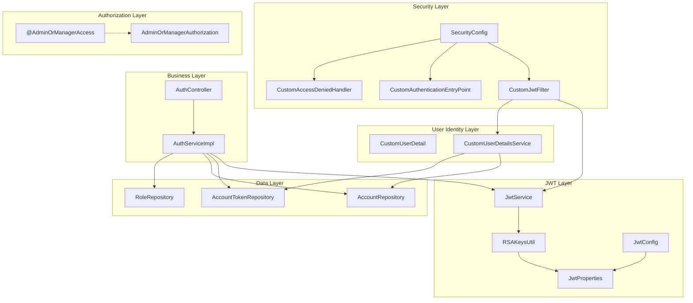
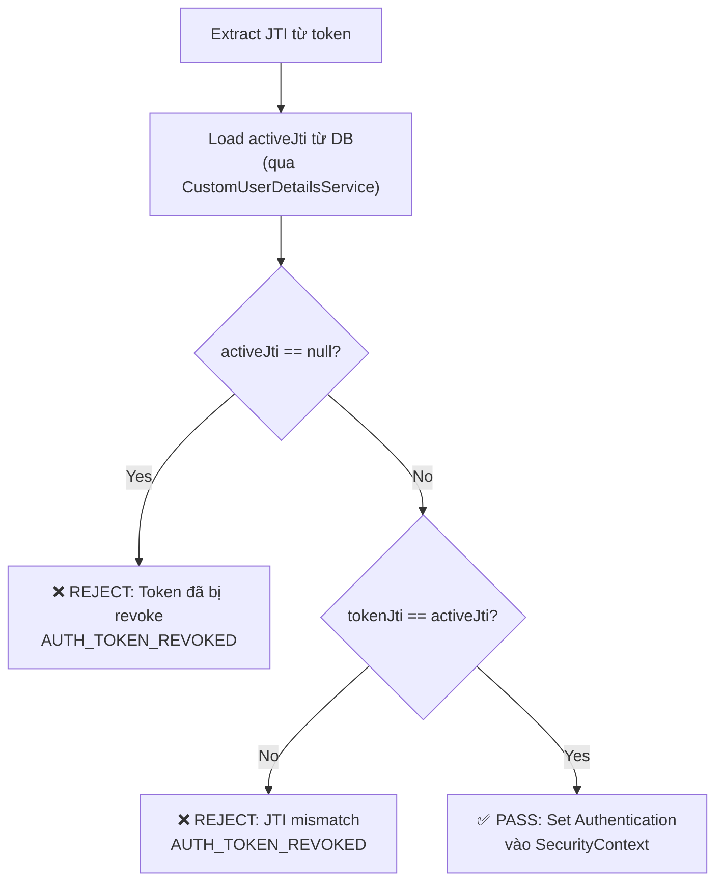
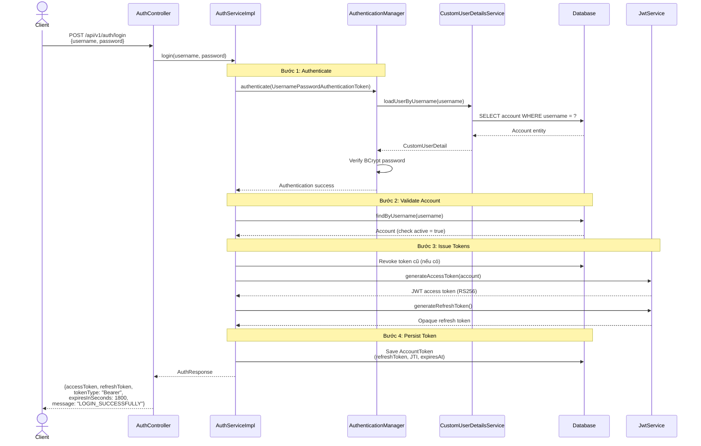
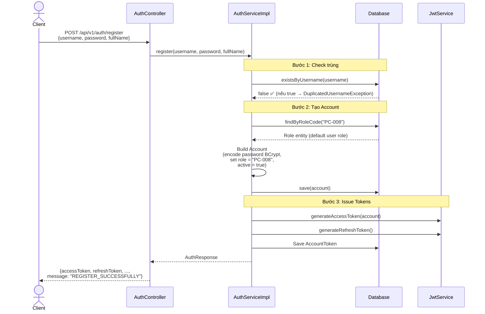
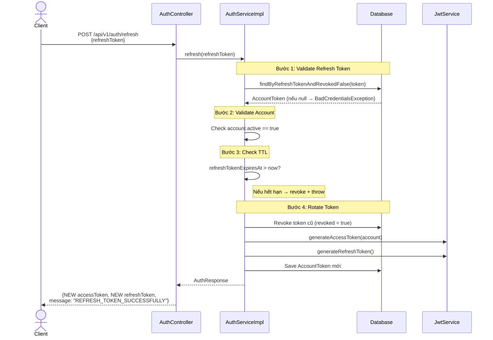
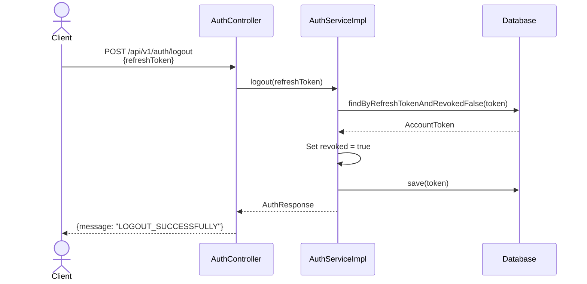
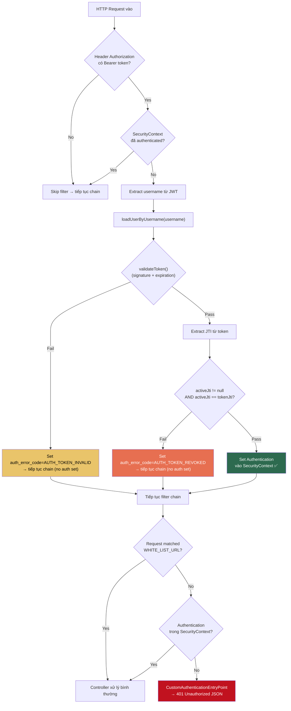
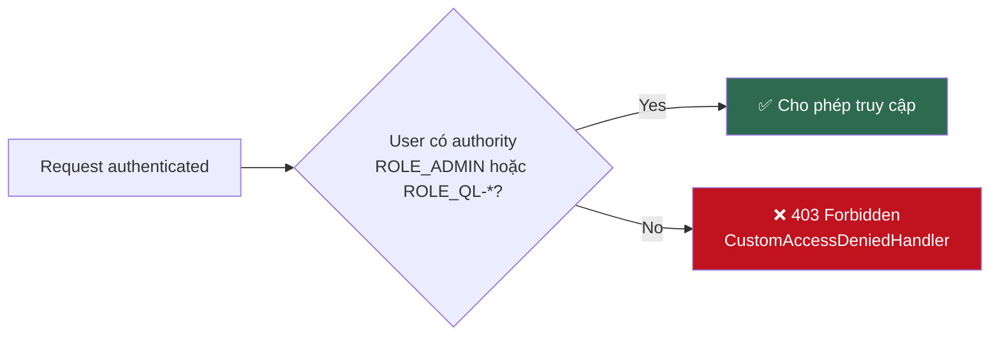
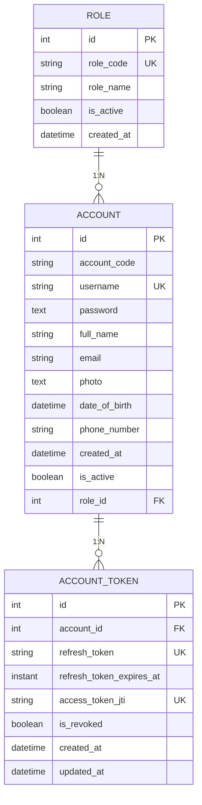
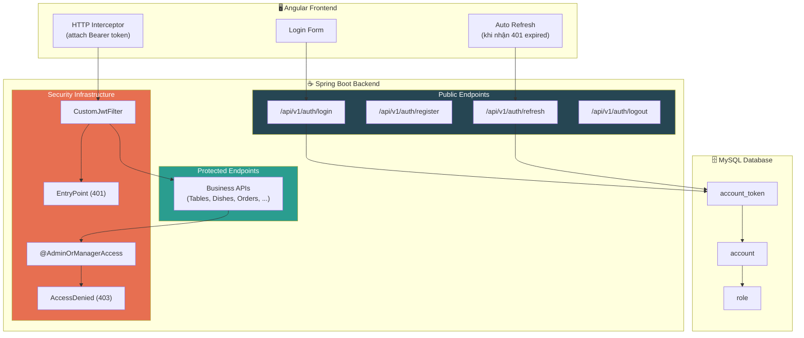

# Báo cáo: Authentication / Authorization — CF Manager Backend

> **Project**: `cf-manager` — Java Spring Boot Backend  
> **Package gốc**: `com.duyminhdev.cf_manager`  
> **Ngày báo cáo**: 15/04/2026

---

## Mục lục

1. [Tổng quan kiến trúc bảo mật](#1-tổng-quan-kiến-trúc-bảo-mật)
2. [JWT — Triển khai chi tiết](#2-jwt--triển-khai-chi-tiết)
3. [Business Flow — Authentication/Authorization](#3-business-flow--authenticationauthorization)
4. [Mô hình dữ liệu](#4-mô-hình-dữ-liệu)
5. [Tổng kết đánh giá](#5-tổng-kết-đánh-giá)

---

## 1. Tổng quan kiến trúc bảo mật

### 1.1. Technology Stack

| Thành phần | Công nghệ |
|---|---|
| Framework | Spring Boot + Spring Security 6 |
| Authentication | JWT (JSON Web Token) — RS256 (RSA Asymmetric) |
| Password Hashing | BCrypt (strength = 10) |
| Session | **Stateless** (`SessionCreationPolicy.STATELESS`) |
| Token Storage | Database (`account_token` table) |
| Key Management | RSA PEM files (PKCS#8 private, X.509 public) |
| CORS | Cho phép `http://localhost:4200` (Angular Frontend) |

### 1.2. Các thành phần chính



### 1.3. Cấu hình Security Filter Chain

File: [SecurityConfig.java](file:///d:/.DATN/cf_manager/BE/cf-manager/cf-manager/src/main/java/com/duyminhdev/cf_manager/config/SecurityConfig.java)

**White-list URL** (không yêu cầu token):

| Endpoint | Mô tả |
|---|---|
| `POST /api/v1/auth/login` | Đăng nhập |
| `POST /api/v1/auth/register` | Đăng ký tài khoản |
| `POST /api/v1/auth/refresh` | Làm mới access token |
| `POST /api/v1/auth/logout` | Đăng xuất |
| `/public/**` | Tài nguyên công khai |
| `/error` | Trang lỗi mặc định |

> [!IMPORTANT]
> Tất cả các request còn lại (`anyRequest().authenticated()`) đều yêu cầu JWT hợp lệ trong header `Authorization: Bearer <token>`.

**Thứ tự xử lý Filter:**

```
Request → CORS Filter → CustomJwtFilter → UsernamePasswordAuthenticationFilter → Controller
```

---

## 2. JWT — Triển khai chi tiết

### 2.1. Thuật toán ký số: RS256 (RSA + SHA-256)

Project sử dụng **asymmetric cryptography** (mật mã bất đối xứng) thay vì HMAC đối xứng:

| Thành phần | Mô tả | File |
|---|---|---|
| Private Key | Ký (sign) access token | `classpath:keys/private_key.pem` (PKCS#8) |
| Public Key | Xác thực (verify) chữ ký token | `classpath:keys/public_key.pem` (X.509) |

File: [RSAKeysUtil.java](file:///d:/.DATN/cf_manager/BE/cf-manager/cf-manager/src/main/java/com/duyminhdev/cf_manager/security/jwt/RSAKeysUtil.java)

- RSA keys được load từ PEM files tại thời điểm khởi động ứng dụng (`@PostConstruct`)
- Private key: đọc format PKCS#8 → `KeyFactory.generatePrivate()`
- Public key: đọc format X.509 → `KeyFactory.generatePublic()`

> [!TIP]
> Ưu điểm RS256 so với HS256:
> - Public key có thể chia sẻ rộng rãi cho các service khác verify token mà không lộ private key
> - Phù hợp kiến trúc microservice trong tương lai
> - An toàn hơn vì private key chỉ tồn tại ở Auth Server

### 2.2. Cấu hình JWT

File cấu hình: `application.properties`

```properties
security.jwt.issuer=cf-manager
security.jwt.access-token-ttl-minutes=30
security.jwt.refresh-token-ttl-days=7
security.jwt.private-key=classpath:keys/private_key.pem
security.jwt.public-key=classpath:keys/public_key.pem
```

Binding qua Java Record: [JwtProperties.java](file:///d:/.DATN/cf_manager/BE/cf-manager/cf-manager/src/main/java/com/duyminhdev/cf_manager/dto/records/JwtProperties.java)

```java
@ConfigurationProperties(prefix = "security.jwt")
public record JwtProperties(
    String issuer,
    long accessTokenTtlMinutes,    // 30 phút
    long refreshTokenTtlDays,      // 7 ngày
    String privateKey,
    String publicKey
) {}
```

### 2.3. Cấu trúc Access Token (JWT)

File: [JwtService.java](file:///d:/.DATN/cf_manager/BE/cf-manager/cf-manager/src/main/java/com/duyminhdev/cf_manager/security/JwtService.java)

**JWT Payload Claims:**

| Claim | Loại | Mô tả |
|---|---|---|
| `sub` (subject) | Standard | Username của tài khoản |
| `iss` (issuer) | Standard | `"cf-manager"` — định danh hệ thống phát hành |
| `iat` (issued at) | Standard | Thời điểm phát hành token |
| `exp` (expiration) | Standard | Thời điểm hết hạn = `iat + 30 phút` |
| `jti` (JWT ID) | Standard | UUID duy nhất — dùng cho **instant revocation** |
| `uid` | Custom | Account ID (integer) |
| `role` | Custom | RoleCode (ví dụ: `"ADMIN"`, `"PC-008"`, `"QL-002"`) |
| `status` | Custom | Trạng thái active của tài khoản |

**Ví dụ JWT Payload đã decode:**
```json
{
  "uid": 1,
  "role": "ADMIN",
  "status": "true",
  "sub": "admin_user",
  "iss": "cf-manager",
  "iat": 1744710000,
  "exp": 1744711800,
  "jti": "a1b2c3d4-e5f6-7890-abcd-ef1234567890"
}
```

### 2.4. Refresh Token — Opaque Token

> [!NOTE]
> Refresh Token **KHÔNG phải JWT**. Đây là một chuỗi opaque (base64-encoded random bytes) được lưu trong database.

```java
public String generateRefreshToken() {
    byte[] bytes = new byte[64];           // 512-bit entropy
    secureRandom.nextBytes(bytes);
    return Base64.getUrlEncoder()
                 .withoutPadding()
                 .encodeToString(bytes);   // URL-safe, 86 chars
}
```

| Thuộc tính | Giá trị |
|---|---|
| Loại | Opaque (random bytes) |
| Độ dài | 64 bytes (512-bit entropy) |
| Encoding | Base64 URL-safe, no padding |
| TTL | 7 ngày |
| Lưu trữ | Bảng `account_token` |

### 2.5. JTI Revocation — Cơ chế thu hồi token tức thời

> [!IMPORTANT]
> Đây là tính năng bảo mật quan trọng nhất của hệ thống. Mỗi access token có một `jti` (JWT ID) duy nhất. Hệ thống lưu `jti` đang active trong bảng `account_token`. Khi cần thu hồi token (logout, refresh, bị đánh cắp), chỉ cần revoke record trong DB → token trở nên vô hiệu **ngay lập tức** dù chưa hết hạn.

**Quy trình kiểm tra JTI trong Filter:**



---

## 3. Business Flow — Authentication/Authorization

### 3.1. Flow: Login (`POST /api/v1/auth/login`)

File: [AuthServiceImpl.java](file:///d:/.DATN/cf_manager/BE/cf-manager/cf-manager/src/main/java/com/duyminhdev/cf_manager/service/impl/AuthServiceImpl.java) — method `login()`



**Validation Chain khi Login:**
1. `AuthenticationManager` authenticate → kiểm tra username tồn tại + password đúng
2. `CustomUserDetailsService.loadUserByUsername()` kiểm tra:
   - Account tồn tại
   - Password không blank
   - Account đang active
   - Role không null, roleCode không blank
   - Role đang active
3. `AuthServiceImpl` kiểm tra lại `account.active`
4. Revoke mọi token cũ → phát hành token mới

---

### 3.2. Flow: Register (`POST /api/v1/auth/register`)



> [!NOTE]
> - Role mặc định cho user thường là `"PC-008"` (tra cứu theo `roleCode` trong bảng `role`)
> - Sau đăng ký, user được đăng nhập tự động (auto-login) — nhận token ngay
> - Endpoint `POST /api/v1/auth/register-admin` yêu cầu annotation `@AdminOrManagerAccess` → chỉ ADMIN hoặc Manager mới có quyền tạo tài khoản admin (role `"ADMIN"`)

---

### 3.3. Flow: Refresh Token (`POST /api/v1/auth/refresh`)



> [!WARNING]
> **Token Rotation**: Mỗi lần refresh, cả access token VÀ refresh token đều bị thay mới. Refresh token cũ bị revoke ngay lập tức. Điều này giúp:
> - Phát hiện token bị đánh cắp (sử dụng refresh token cũ sẽ thất bại)
> - Giới hạn thời gian tấn công nếu refresh token bị lộ

---

### 3.4. Flow: Logout (`POST /api/v1/auth/logout`)



> [!IMPORTANT]
> Logout revoke cả phiên làm việc: khi `AccountToken.revoked = true`, cả refresh token VÀ access token (qua JTI mismatch) đều trở nên vô hiệu tức thời.

---

### 3.5. Flow: Request Authentication (JWT Filter)

File: [CustomJwtFilter.java](file:///d:/.DATN/cf_manager/BE/cf-manager/cf-manager/src/main/java/com/duyminhdev/cf_manager/security/jwt/CustomJwtFilter.java)



**Error Codes trong Filter:**

| Error Code | HTTP Status | Mô tả |
|---|---|---|
| `AUTH_TOKEN_EXPIRED` | 401 | Access token đã hết hạn (>30 phút) |
| `AUTH_TOKEN_INVALID` | 401 | Token không hợp lệ (sai signature, format) |
| `AUTH_TOKEN_REVOKED` | 401 | Token đã bị thu hồi (JTI mismatch hoặc null) |
| `AUTH_USER_NOT_FOUND` | 401 | User trong token không tồn tại trong DB |
| `AUTH_TOKEN_ERROR` | 401 | Lỗi không xác định khi xử lý token |
| `AUTH_UNAUTHORIZED` | 401 | Mặc định — không có token hoặc token không xác định |
| `ACCESS_DENIED` | 403 | User authenticated nhưng không đủ quyền |

---

### 3.6. Flow: Authorization (Phân quyền)

#### Role-Based Access Control (RBAC)

**Mô hình Role:**

| RoleCode | Loại | Mô tả |
|---|---|---|
| `ADMIN` | Admin | Quản trị viên — toàn quyền |
| `QL-xxx` | Manager | Quản lý (prefix `QL-`) — quyền quản lý |
| `PC-008` | User | Nhân viên/User thường — quyền cơ bản |

**Cơ chế Spring Security Authority:**

File: [CustomUserDetail.java](file:///d:/.DATN/cf_manager/BE/cf-manager/cf-manager/src/main/java/com/duyminhdev/cf_manager/security/CustomUserDetail.java)

```java
// RoleCode được prefix "ROLE_" theo convention Spring Security
String prefixed = roleCode.startsWith("ROLE_") ? roleCode : "ROLE_" + roleCode;
// Ví dụ: "ADMIN" → "ROLE_ADMIN", "QL-002" → "ROLE_QL-002"
this.authorities = List.of(new SimpleGrantedAuthority(prefixed));
```

#### Custom Authorization Annotation: `@AdminOrManagerAccess`

File: [AdminOrManagerAccess.java](file:///d:/.DATN/cf_manager/BE/cf-manager/cf-manager/src/main/java/com/duyminhdev/cf_manager/security/authorization/AdminOrManagerAccess.java)

```java
@PreAuthorize("@adminOrManagerAuthorization.check(authentication)")
public @interface AdminOrManagerAccess {}
```

File: [AdminOrManagerAuthorization.java](file:///d:/.DATN/cf_manager/BE/cf-manager/cf-manager/src/main/java/com/duyminhdev/cf_manager/security/authorization/AdminOrManagerAuthorization.java)

```java
// Logic: cho phép nếu authority là "ROLE_ADMIN" HOẶC bắt đầu bằng "ROLE_QL-"
return authentication.getAuthorities().stream()
    .map(GrantedAuthority::getAuthority)
    .anyMatch(auth -> "ROLE_ADMIN".equals(auth) || auth.startsWith("ROLE_QL-"));
```

**Nơi sử dụng `@AdminOrManagerAccess`:**

Annotation này được áp dụng level method/class trên các controller cần quyền quản trị:
- `AuthController.registerAdmin()` — chỉ Admin/Manager mới tạo được tài khoản admin
- Nhiều controller nghiệp vụ khác: `TableController`, `DishController`, `DishCategoryController`, `DishOrderController`, `DishOrderDetailController`, `InvoiceController`, `PaymentMethodController`, `TableBookingController`



---

## 4. Mô hình dữ liệu

### 4.1. Entity Relationship



### 4.2. Chi tiết bảng `account_token`

| Column | Type | Constraint | Mô tả |
|---|---|---|---|
| `id` | INT | PK AUTO_INCREMENT | ID Token |
| `account_id` | INT | FK → account.id, NOT NULL | Tài khoản sở hữu |
| `refresh_token` | VARCHAR(255) | UNIQUE | Opaque refresh token |
| `refresh_token_expires_at` | TIMESTAMP | — | Thời điểm hết hạn refresh token |
| `access_token_jti` | VARCHAR(255) | UNIQUE | JWT ID của access token đang active |
| `is_revoked` | TINYINT(1) | NOT NULL, DEFAULT 0 | Đã bị thu hồi chưa |
| `created_at` | DATETIME | NOT NULL, DEFAULT NOW | Thời điểm tạo |
| `updated_at` | DATETIME | NOT NULL, ON UPDATE NOW | Thời điểm cập nhật |

> [!NOTE]
> Hệ thống áp dụng **single active token pattern**: mỗi account chỉ có tối đa 1 `AccountToken` với `revoked = false` tại mỗi thời điểm. Đăng nhập mới hoặc refresh đều revoke token cũ trước khi phát hành token mới.

---

## 5. Tổng kết đánh giá

### 5.1. Điểm mạnh

| # | Điểm mạnh | Chi tiết |
|---|---|---|
| 1 | **RS256 Asymmetric Signing** | Sử dụng RSA thay vì HMAC — an toàn hơn, phù hợp microservice |
| 2 | **JTI Instant Revocation** | Token có thể bị thu hồi tức thời thay vì chờ hết hạn tự nhiên |
| 3 | **Refresh Token Rotation** | Mỗi lần refresh đều thay mới cả 2 token — giảm rủi ro token bị đánh cắp |
| 4 | **Single Active Session** | Mỗi account chỉ có 1 phiên active — login mới tự invalidate phiên cũ |
| 5 | **Opaque Refresh Token** | Refresh token không chứa thông tin nhạy cảm, chỉ dùng làm lookup key |
| 6 | **Custom Error Codes** | Phân biệt rõ ràng các loại lỗi auth (expired, invalid, revoked) giúp client xử lý chính xác |
| 7 | **Custom Authorization Annotation** | `@AdminOrManagerAccess` — clean, reusable, support flexible role patterns (prefix `QL-`) |
| 8 | **Stateless Architecture** | Không dùng HTTP Session — scale horizontal dễ dàng |
| 9 | **Expired Token Cleanup** | `AccountTokenRepository.revokeExpiredRefreshTokens()` — dọn dẹp token hết hạn tự động (scheduler) |

### 5.2. Sơ đồ tổng quan End-to-End



---

> **Kết luận**: Hệ thống Authentication/Authorization của project CF Manager được triển khai theo kiến trúc **Stateless JWT** với nhiều lớp bảo mật chuyên sâu bao gồm RS256 asymmetric signing, JTI-based instant revocation, refresh token rotation, và single active session enforcement. Mô hình phân quyền RBAC linh hoạt với custom annotation `@AdminOrManagerAccess` hỗ trợ cả exact match (`ROLE_ADMIN`) lẫn prefix match (`ROLE_QL-*`).
