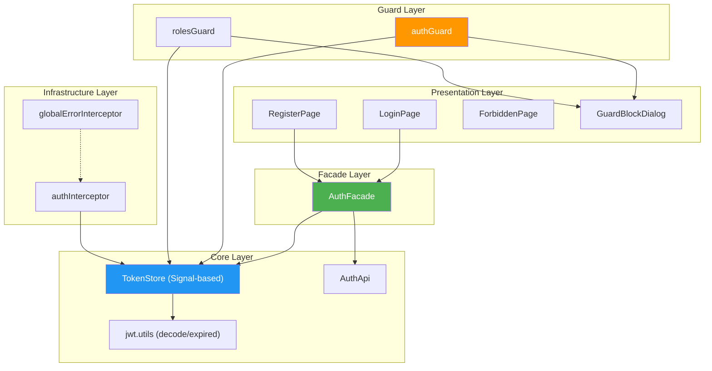
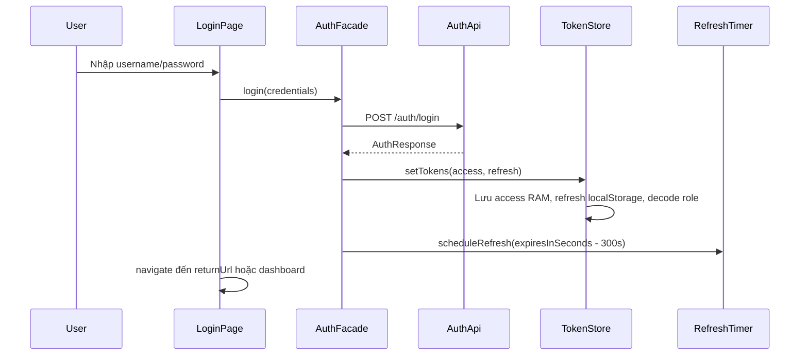
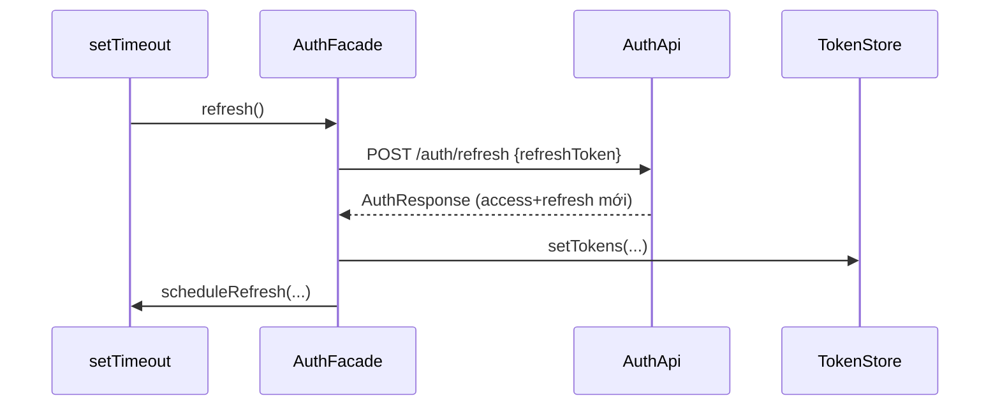
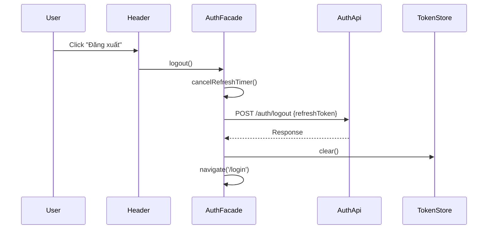

Đánh giá sao về bản plan cho FE mới như sau ? 
Dưới đây là **Kế hoạch triển khai chi tiết cho Hệ thống Frontend mới** (Angular Standalone) tích hợp với Backend CF Manager. Kế hoạch được xây dựng dựa trên phân tích hai báo cáo bạn đã cung cấp, kết hợp kiến trúc Frontend hiện đại và các yêu cầu cụ thể từ Backend.

---

# IMPLEMENTATION PLAN: HỆ THỐNG AUTHENTICATION FRONTEND (ANGULAR)

**Dự án:** Angular Standalone Frontend tích hợp CF Manager Backend  
**Ngày lập kế hoạch:** 15/04/2026  
**Phiên bản:** 1.0  
**Người phụ trách:** Senior Angular Developer

---

## Mục lục

1. [Phân tích yêu cầu và ràng buộc từ Backend](#1-phân-tích-yêu-cầu-và-ràng-buộc-từ-backend)
2. [Kiến trúc tổng thể Frontend](#2-kiến-trúc-tổng-thể-frontend)
3. [Chi tiết các module cần xây dựng](#3-chi-tiết-các-module-cần-xây-dựng)
4. [Luồng hoạt động chính](#4-luồng-hoạt-động-chính)
5. [Kế hoạch triển khai theo ngày (Timeline)](#5-kế-hoạch-triển-khai-theo-ngày-timeline)
6. [Danh sách kiểm thử (Testing Checklist)](#6-danh-sách-kiểm-thử-testing-checklist)
7. [Phụ lục: Cấu hình Môi trường & Biến](#7-phụ-lục-cấu-hình-môi-trường--biến)

---

## 1. Phân tích yêu cầu và ràng buộc từ Backend

Dựa trên báo cáo Backend, chúng ta có các đặc điểm quan trọng ảnh hưởng trực tiếp đến thiết kế Frontend:

| Đặc điểm Backend | Tác động đến Frontend | Hành động cần thực hiện |
|------------------|------------------------|--------------------------|
| **JWT RS256 (Asymmetric)** | Không cần giải mã chữ ký (chỉ backend verify), FE chỉ cần decode payload Base64. | Dùng thư viện `jwt-decode` hoặc tự viết hàm `atob`. |
| **Access Token TTL = 30 phút** | Cần cơ chế **pre-emptive refresh** (làm mới trước 5 phút hết hạn). | Cài đặt `setTimeout` trong AuthFacade với delay = `(TTL - 300) * 1000`. |
| **Refresh Token Rotation** | Mỗi lần gọi `/refresh`, FE nhận **cả access và refresh mới**, phải lưu lại refresh mới và hủy timer cũ. | Trong `refresh()` API response, gọi `setTokens()` để cập nhật cả hai token và lên lịch timer mới. |
| **JTI Instant Revocation** | Nếu token bị revoke (do logout ở tab khác), BE trả về lỗi 401 với code `AUTH_TOKEN_REVOKED`. | Interceptor phải bắt lỗi 401, kiểm tra error code từ response body (nếu có) để phân biệt hết hạn và bị revoke. |
| **Single Active Session** | Đăng nhập ở nơi khác sẽ revoke token hiện tại. | FE nên hiển thị thông báo "Phiên làm việc đã bị kết thúc ở nơi khác" và tự động logout. |
| **Custom Error Codes** | Backend trả về chi tiết lỗi trong JSON body. | Global Error Interceptor cần parse các mã lỗi: `AUTH_TOKEN_EXPIRED`, `AUTH_TOKEN_REVOKED`, `BAD_CREDENTIALS`, v.v. |
| **CORS chỉ cho phép `localhost:4200`** | Trong môi trường dev, FE chạy đúng port 4200. | Cấu hình `angular.json` hoặc `proxy.conf.json` để tránh CORS khi gọi API khác domain. |
| **Role Format** | Backend dùng roleCode như `ADMIN`, `QL-002`, `PC-008`. Trong authority có prefix `ROLE_`. | FE chỉ cần lưu `role` (không có `ROLE_`) từ JWT payload để so sánh. |

---

## 2. Kiến trúc tổng thể Frontend

Áp dụng mô hình đã được chứng minh từ báo cáo trước, với một số điều chỉnh nhỏ để phù hợp backend mới.



---

## 3. Chi tiết các module cần xây dựng

### 3.1. Models & Types (`auth.model.ts`)

```typescript
// DTO cho Login
export interface LoginRequest {
  username: string;
  password: string;
}

// DTO cho Register
export interface RegisterRequest {
  username: string;
  password: string;
  fullName: string;
}

// Response từ các endpoint /login, /register, /refresh
export interface AuthResponse {
  accessToken: string;
  refreshToken: string;
  tokenType: 'Bearer';
  expiresInSeconds: number; // 1800 (30 phút)
  message: string;
}

// Refresh Request
export interface RefreshRequest {
  refreshToken: string;
}

// Logout Request
export interface LogoutRequest {
  refreshToken: string;
}

// JWT Payload (sau decode)
export interface JwtPayload {
  sub: string;        // username
  iss: string;        // 'cf-manager'
  iat: number;
  exp: number;
  jti: string;        // JWT ID để revoke
  uid: number;        // Account ID
  role: string;       // 'ADMIN', 'QL-002', 'PC-008'
  status: string;     // 'true' / 'false'
}

// API Error Response từ Backend
export interface ApiError {
  code: string;       // e.g., 'AUTH_TOKEN_EXPIRED'
  message: string;    // Mô tả tiếng Việt
  details?: string[];
  timestamp: string;
}
```

### 3.2. Token Store (`token.store.ts`)

```typescript
@Injectable({ providedIn: 'root' })
export class TokenStore {
  // RAM only
  private readonly _accessToken = signal<string | null>(null);
  
  // Persisted
  private readonly _refreshToken = signal<string | null>(localStorage.getItem('refresh_token'));
  private readonly _role = signal<string | null>(localStorage.getItem('role'));
  private readonly _uid = signal<string | null>(localStorage.getItem('uid'));

  readonly accessToken = this._accessToken.asReadonly();
  readonly refreshToken = this._refreshToken.asReadonly();
  readonly role = this._role.asReadonly();
  readonly uid = this._uid.asReadonly();

  // Computed
  readonly isLoggedIn = computed(() => !!this.accessToken() || !!this.refreshToken());
  readonly isAccessExpired = computed(() => {
    const token = this.accessToken();
    if (!token) return true;
    try {
      const payload = decodeJwtPayload<JwtPayload>(token);
      return isJwtExpired(payload.exp);
    } catch {
      return true;
    }
  });

  setTokens(accessToken: string, refreshToken: string): void {
    this._accessToken.set(accessToken);
    this._refreshToken.set(refreshToken);
    localStorage.setItem('refresh_token', refreshToken);

    // Giải mã và lưu profile
    const payload = decodeJwtPayload<JwtPayload>(accessToken);
    this._role.set(payload.role);
    this._uid.set(payload.uid.toString());
    localStorage.setItem('role', payload.role);
    localStorage.setItem('uid', payload.uid.toString());
  }

  clear(): void {
    this._accessToken.set(null);
    this._refreshToken.set(null);
    this._role.set(null);
    this._uid.set(null);
    localStorage.removeItem('refresh_token');
    localStorage.removeItem('role');
    localStorage.removeItem('uid');
  }

  // Khôi phục profile từ localStorage khi app khởi động (chưa có access token)
  restoreProfileFromStorage(): void {
    const role = localStorage.getItem('role');
    const uid = localStorage.getItem('uid');
    if (role) this._role.set(role);
    if (uid) this._uid.set(uid);
  }
}
```

### 3.3. JWT Utilities (`jwt.utils.ts`)

```typescript
export function decodeJwtPayload<T>(token: string): T {
  const parts = token.split('.');
  if (parts.length !== 3) throw new Error('Invalid JWT');
  const payload = parts[1];
  const decoded = atob(payload.replace(/-/g, '+').replace(/_/g, '/'));
  return JSON.parse(decoded);
}

export function isJwtExpired(exp: number): boolean {
  // exp là seconds since epoch
  return Date.now() >= exp * 1000;
}
```

### 3.4. Auth API Service (`auth.api.ts`)

```typescript
@Injectable({ providedIn: 'root' })
export class AuthApi {
  private readonly baseUrl = environment.apiUrl; // e.g., http://localhost:8080/api/v1/auth

  constructor(private http: HttpClient) {}

  login(body: LoginRequest): Observable<AuthResponse> {
    return this.http.post<AuthResponse>(`${this.baseUrl}/login`, body);
  }

  register(body: RegisterRequest): Observable<AuthResponse> {
    return this.http.post<AuthResponse>(`${this.baseUrl}/register`, body);
  }

  refresh(body: RefreshRequest): Observable<AuthResponse> {
    return this.http.post<AuthResponse>(`${this.baseUrl}/refresh`, body);
  }

  logout(body: LogoutRequest): Observable<AuthResponse> {
    return this.http.post<AuthResponse>(`${this.baseUrl}/logout`, body);
  }
}
```

### 3.5. Auth Facade (`auth.facade.ts`)

```typescript
@Injectable({ providedIn: 'root' })
export class AuthFacade {
  private refreshTimer: any;
  
  constructor(
    private authApi: AuthApi,
    private tokenStore: TokenStore,
    private router: Router
  ) {}

  login(credentials: LoginRequest): Observable<AuthResponse> {
    return this.authApi.login(credentials).pipe(
      tap(res => this.handleAuthSuccess(res)),
      catchError(err => {
        // Để global error interceptor hiển thị
        return throwError(() => err);
      })
    );
  }

  register(data: RegisterRequest): Observable<AuthResponse> {
    return this.authApi.register(data).pipe(
      tap(res => this.handleAuthSuccess(res))
    );
  }

  refresh(): Observable<AuthResponse> {
    const refreshToken = this.tokenStore.refreshToken();
    if (!refreshToken) {
      return throwError(() => new Error('No refresh token'));
    }
    return this.authApi.refresh({ refreshToken }).pipe(
      tap(res => this.handleAuthSuccess(res)),
      catchError(err => {
        this.logout(false); // silent logout
        return throwError(() => err);
      })
    );
  }

  logout(shouldCallApi = true): Observable<AuthResponse | null> {
    this.cancelRefreshTimer();
    const refreshToken = this.tokenStore.refreshToken();
    
    const logout$ = (refreshToken && shouldCallApi) 
      ? this.authApi.logout({ refreshToken }).pipe(catchError(() => of(null)))
      : of(null);
    
    return logout$.pipe(
      tap(() => {
        this.tokenStore.clear();
        this.router.navigate(['/login']);
      })
    );
  }

  // Gọi khi app khởi động để khôi phục session
  restoreSession(): void {
    this.tokenStore.restoreProfileFromStorage();
    const refreshToken = this.tokenStore.refreshToken();
    if (refreshToken) {
      this.refresh().subscribe({
        error: () => this.tokenStore.clear()
      });
    }
  }

  private handleAuthSuccess(res: AuthResponse): void {
    this.tokenStore.setTokens(res.accessToken, res.refreshToken);
    this.scheduleRefresh(res.expiresInSeconds);
  }

  private scheduleRefresh(expiresInSeconds: number): void {
    this.cancelRefreshTimer();
    const delaySeconds = Math.max(0, expiresInSeconds - 300); // 5 phút buffer
    const delayMs = delaySeconds * 1000;
    console.log(`[Auth] Scheduling refresh in ${delaySeconds} seconds`);
    this.refreshTimer = setTimeout(() => {
      this.refresh().subscribe();
    }, delayMs);
  }

  private cancelRefreshTimer(): void {
    if (this.refreshTimer) {
      clearTimeout(this.refreshTimer);
      this.refreshTimer = null;
    }
  }
}
```

### 3.6. HTTP Interceptors

#### a. Auth Interceptor (`auth.interceptor.ts`)

```typescript
export const authInterceptor: HttpInterceptorFn = (req, next) => {
  const tokenStore = inject(TokenStore);
  const router = inject(Router);
  
  // Bỏ qua gắn token cho các endpoint auth
  if (req.url.includes('/auth/')) {
    return next(req);
  }

  const token = tokenStore.accessToken();
  if (token) {
    req = req.clone({
      setHeaders: { Authorization: `Bearer ${token}` }
    });
  }

  return next(req).pipe(
    catchError((error: HttpErrorResponse) => {
      if (error.status === 401) {
        const apiError = error.error as ApiError;
        // Kiểm tra nếu token bị revoke (do logout ở nơi khác)
        if (apiError?.code === 'AUTH_TOKEN_REVOKED') {
          tokenStore.clear();
          router.navigate(['/login'], { 
            queryParams: { reason: 'session_revoked' } 
          });
        }
        // Với AUTH_TOKEN_EXPIRED, có thể để Facade tự refresh, nhưng do ta dùng pre-emptive nên trường hợp này ít xảy ra.
        // Nếu xảy ra, vẫn logout và yêu cầu login lại.
        else if (apiError?.code === 'AUTH_TOKEN_EXPIRED') {
          tokenStore.clear();
          router.navigate(['/login']);
        }
      }
      return throwError(() => error);
    })
  );
};
```

#### b. Global Error Interceptor (`global-error.interceptor.ts`)

```typescript
export const globalErrorInterceptor: HttpInterceptorFn = (req, next) => {
  const alertService = inject(TuiAlertService); // Hoặc MatSnackBar
  
  // Không hiển thị lỗi cho endpoint refresh (đã xử lý trong facade)
  const EXCLUDED_URLS = ['/auth/refresh'];
  if (EXCLUDED_URLS.some(url => req.url.includes(url))) {
    return next(req);
  }

  return next(req).pipe(
    catchError((error: HttpErrorResponse) => {
      let errorMessage = 'Đã xảy ra lỗi không xác định';
      
      if (error.error instanceof ErrorEvent) {
        // Client-side error
        errorMessage = error.error.message;
      } else {
        // Server-side error
        const apiError = error.error as ApiError;
        if (apiError?.message) {
          errorMessage = apiError.message;
        } else if (apiError?.code) {
          errorMessage = ERROR_CODE_MESSAGES[apiError.code] || `Lỗi: ${apiError.code}`;
        } else {
          errorMessage = HTTP_STATUS_MESSAGES[error.status] || `Lỗi HTTP ${error.status}`;
        }
      }
      
      alertService.open(errorMessage, { status: 'error' }).subscribe();
      return throwError(() => error);
    })
  );
};

const ERROR_CODE_MESSAGES: Record<string, string> = {
  BAD_CREDENTIALS: 'Sai tên đăng nhập hoặc mật khẩu',
  DUPLICATED_USERNAME: 'Tên đăng nhập đã tồn tại',
  AUTH_TOKEN_EXPIRED: 'Phiên làm việc đã hết hạn, vui lòng đăng nhập lại',
  AUTH_TOKEN_REVOKED: 'Phiên làm việc đã bị kết thúc ở nơi khác',
  // ... thêm các mã khác
};

const HTTP_STATUS_MESSAGES: Record<number, string> = {
  403: 'Bạn không có quyền truy cập tài nguyên này',
  404: 'Không tìm thấy tài nguyên',
  500: 'Lỗi máy chủ, vui lòng thử lại sau'
};
```

### 3.7. Guards

#### a. Auth Guard (`auth.guard.ts`)

```typescript
let authDialogOpen = false;

export const authGuard: CanMatchFn = (route, segments) => {
  const tokenStore = inject(TokenStore);
  const dialogService = inject(TuiDialogService);
  const router = inject(Router);
  
  const state = router.getCurrentNavigation()?.extractedUrl.toString() || '';
  
  if (tokenStore.accessToken() || tokenStore.refreshToken()) {
    return true;
  }

  if (!authDialogOpen) {
    authDialogOpen = true;
    dialogService.open(GuardBlockDialog, {
      data: { 
        title: 'Yêu cầu đăng nhập',
        content: 'Bạn cần đăng nhập để truy cập trang này.',
        returnUrl: state 
      }
    }).subscribe({
      complete: () => { authDialogOpen = false; }
    });
  }
  return false;
};
```

#### b. Roles Guard (`roles.guard.ts`)

```typescript
export const rolesGuard = (allowedRoles: string[]): CanMatchFn => {
  return (route, segments) => {
    const tokenStore = inject(TokenStore);
    const router = inject(Router);
    const dialogService = inject(TuiDialogService);
    
    // Nếu chưa có refresh token => chưa login
    if (!tokenStore.refreshToken()) {
      return false; // authGuard sẽ xử lý dialog
    }
    
    const userRole = tokenStore.role();
    // Nếu role đã có, kiểm tra luôn
    if (userRole) {
      if (allowedRoles.includes(userRole)) {
        return true;
      } else {
        router.navigate(['/forbidden']);
        return false;
      }
    }
    
    // Role chưa hydrate (ví dụ vừa reload trang, access token chưa có)
    // Cho phép tạm thời, interceptor sẽ refresh và hydrate role.
    // Nếu sau khi refresh role vẫn không khớp, guard ở lần sau hoặc component sẽ redirect.
    return true;
  };
};
```

### 3.8. Routing Configuration (`app.routes.ts`)

```typescript
export const routes: Routes = [
  { path: 'login', loadComponent: () => import('./features/login/login.page').then(m => m.LoginPage) },
  { path: 'register', loadComponent: () => import('./features/register/register.page').then(m => m.RegisterPage) },
  { path: 'forbidden', loadComponent: () => import('./features/forbidden/forbidden.page').then(m => m.ForbiddenPage) },
  
  {
    path: 'dashboard',
    canMatch: [authGuard],
    loadComponent: () => import('./layout/main.layout').then(m => m.MainLayout),
    children: [
      { path: '', loadComponent: () => import('./features/home/home.page').then(m => m.HomePage) },
      {
        path: 'tables',
        canMatch: [rolesGuard(['ADMIN', 'QL-002', 'QL-003'])], // Admin và các manager có prefix QL-
        loadComponent: () => import('./features/tables/table-list.page').then(m => m.TableListPage)
      },
      {
        path: 'admin',
        canMatch: [rolesGuard(['ADMIN'])],
        loadComponent: () => import('./features/admin/admin.page').then(m => m.AdminPage)
      }
    ]
  },
  
  { path: '', redirectTo: '/dashboard', pathMatch: 'full' },
  { path: '**', redirectTo: '/dashboard' }
];
```

### 3.9. App Initialization (`app.component.ts`)

```typescript
export class AppComponent implements OnInit {
  private authFacade = inject(AuthFacade);
  
  ngOnInit(): void {
    this.authFacade.restoreSession();
  }
}
```

---

## 4. Luồng hoạt động chính

### 4.1. Luồng đăng nhập



### 4.2. Luồng tự động refresh



### 4.3. Luồng logout



---

## 5. Kế hoạch triển khai theo ngày (Timeline)

### Tuần 1: Chuẩn bị môi trường và core services

| Ngày | Công việc | Người thực hiện | Kết quả |
|------|-----------|-----------------|---------|
| 1 | Khởi tạo project Angular (Standalone), cài đặt Taiga UI hoặc Material, cấu hình ESLint/Prettier | Dev | Project chạy được trên `localhost:4200` |
| 2 | Tạo các model (`auth.model.ts`, `api-error.model.ts`) và utilities (`jwt.utils.ts`) | Dev | Các type sẵn sàng |
| 3 | Xây dựng `TokenStore` (Signal-based), viết unit test cơ bản | Dev | TokenStore hoạt động |
| 4 | Xây dựng `AuthApi` và `AuthFacade` (không có timer) | Dev | Login/logout gọi API thành công |
| 5 | Cài đặt `AuthInterceptor` và `GlobalErrorInterceptor` | Dev | Request được gắn token, lỗi hiển thị đúng |

### Tuần 2: Hoàn thiện luồng auth và Guards

| Ngày | Công việc | Người thực hiện | Kết quả |
|------|-----------|-----------------|---------|
| 6 | Thêm logic pre-emptive refresh vào `AuthFacade`, test timer | Dev | Token tự refresh trước 5 phút |
| 7 | Xây dựng `authGuard` và `rolesGuard`, component `GuardBlockDialog` | Dev | Chặn truy cập và hiển thị dialog |
| 8 | Cấu hình routing đầy đủ, lazy loading các module | Dev | Điều hướng đúng với phân quyền |
| 9 | Xây dựng UI: `LoginPage`, `RegisterPage`, `ForbiddenPage` | Dev + Designer | Giao diện responsive, validation form |
| 10 | Tích hợp `restoreSession()` trong `AppComponent`, test reload trang | Dev | Sau reload vẫn giữ trạng thái login |

### Tuần 3: Kiểm thử và hoàn thiện

| Ngày | Công việc | Người thực hiện | Kết quả |
|------|-----------|-----------------|---------|
| 11 | Viết unit test cho `AuthFacade`, `TokenStore`, `Guards` | Dev | Coverage >80% cho module auth |
| 12 | Kiểm thử tích hợp với Backend thật (local/staging) | Dev + QA | Tất cả luồng auth hoạt động đúng spec |
| 13 | Xử lý các edge cases: 401 khi refresh, token revoke, network error | Dev | Thông báo lỗi thân thiện |
| 14 | Tối ưu performance, bundle size, lazy loading | Dev | Tải trang nhanh, chunk nhỏ |
| 15 | Viết tài liệu hướng dẫn cho team, review code | Dev | Tài liệu sẵn sàng, code merged |

---

## 6. Danh sách kiểm thử (Testing Checklist)

### 6.1. Chức năng cơ bản

- [ ] Đăng ký tài khoản mới thành công, tự động đăng nhập.
- [ ] Đăng nhập với thông tin đúng → redirect về dashboard, token lưu đúng nơi.
- [ ] Đăng nhập sai → hiển thị lỗi "Sai tên đăng nhập hoặc mật khẩu".
- [ ] Đăng xuất → token bị xóa, redirect về login.
- [ ] Reload trang (F5) khi đang login → tự động refresh token, không bị logout.
- [ ] Sau 30 phút không tương tác, token tự refresh (kiểm tra qua network tab).
- [ ] Khi token hết hạn và không refresh được → tự logout về login.

### 6.2. Phân quyền

- [ ] User role `PC-008` truy cập route `/dashboard/admin` → redirect `/forbidden`.
- [ ] Admin truy cập tất cả các route được phép.
- [ ] Guard hiển thị dialog khi chưa login, click "Đăng nhập" chuyển hướng đúng returnUrl.

### 6.3. Xử lý lỗi

- [ ] Backend trả lỗi 500 → hiển thị toast "Lỗi máy chủ...".
- [ ] Mất kết nối mạng → hiển thị thông báo phù hợp.
- [ ] Token bị revoke (do logout ở tab khác) → tự logout và thông báo "Phiên làm việc đã bị kết thúc ở nơi khác".

---

## 7. Phụ lục: Cấu hình Môi trường & Biến

### 7.1. Environment files

**`environment.ts` (development)**
```typescript
export const environment = {
  production: false,
  apiUrl: 'http://localhost:8080/api/v1'
};
```

**`environment.prod.ts`**
```typescript
export const environment = {
  production: true,
  apiUrl: 'https://api.cfmanager.com/api/v1'
};
```

### 7.2. Proxy configuration (tránh CORS khi dev)

**`proxy.conf.json`**
```json
{
  "/api": {
    "target": "http://localhost:8080",
    "secure": false,
    "changeOrigin": true
  }
}
```
Sau đó chạy `ng serve --proxy-config proxy.conf.json`.

---

## Kết luận

Kế hoạch trên đã bám sát đặc tả từ Backend CF Manager và áp dụng kiến trúc Frontend đã được kiểm chứng từ dự án trước. Với timeline 3 tuần, team có thể triển khai một hệ thống authentication mạnh mẽ, bảo mật và thân thiện với người dùng.

**Các điểm mạnh của giải pháp:**
- Tận dụng Signal để quản lý state reactive, giảm boilerplate.
- Pre-emptive refresh đảm bảo trải nghiệm không gián đoạn.
- Xử lý lỗi chi tiết theo mã lỗi backend.
- Kiến trúc phân lớp rõ ràng, dễ bảo trì và mở rộng.

Hãy bắt đầu triển khai theo kế hoạch trên và liên hệ lại nếu có bất kỳ vướng mắc nào trong quá trình thực hiện.